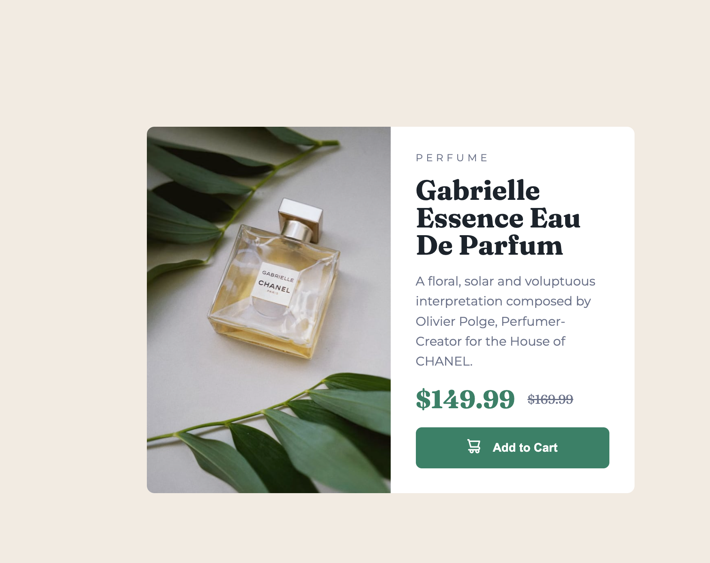

# Frontend Mentor - Product preview card component solution

This is a solution to the [Product preview card component challenge on Frontend Mentor](https://www.frontendmentor.io/challenges/product-preview-card-component-GO7UmttRfa). Frontend Mentor challenges help you improve your coding skills by building realistic projects. 

## Table of contents

- [Frontend Mentor - Product preview card component solution](#frontend-mentor---product-preview-card-component-solution)
  - [Table of contents](#table-of-contents)
  - [Overview](#overview)
    - [The challenge](#the-challenge)
    - [Screenshot](#screenshot)
    - [Links](#links)
  - [My process](#my-process)
    - [Built with](#built-with)
    - [What I learned](#what-i-learned)
        - [Using PostCSS with Vite](#using-postcss-with-vite)
        - [Emmet](#emmet)
        - [Pseudo-elements](#pseudo-elements)
        - [Nested selectors](#nested-selectors)
        - [`:not` and `:last-child` selectors](#not-and-last-child-selectors)
        - [Media queries](#media-queries)
        - [Box shadow](#box-shadow)
    - [Continued development](#continued-development)
  - [Author](#author)

## Overview

### The challenge

Users should be able to:

- View the optimal layout depending on their device's screen size
- See hover and focus states for interactive elements

### Screenshot



### Links

- Solution URL: [Solution Page](https://your-solution-url.com)
- Live Site URL: [Live Site](https://master--astounding-malabi-e72b79.netlify.app/)

## My process

### Built with

- Flexbox
- Box shadow
- Pseudo-elements
- [PostCSS](https://postcss.org/)
  - Nested Selectors
  - Variables
  - Utilities
  - Custom Media Queries
- [Vite](https://vitejs.dev/)

### What I learned

##### Using PostCSS with Vite
This project allowed me to get familiar with configuring PostCSS to work with vite, adding plugins, etc.

Install :
```sh
npm i -D vite postcss-css-variables postcss-utilities postcss-nested postcss-custom-media
```

postcss.config.js

```js
module.exports = {
  plugins: [
    require('postcss-nested'),
    require('postcss-css-variables'),
    require('postcss-utilities'),
    require('postcss-custom-media'),
  ],
};
```

*NOTE: When using the postcss vscode extension, you need to add postcss to the emmet.include languages setting for css property autocompletion to work. See https://marketplace.visualstudio.com/items?itemName=vunguyentuan.vscode-postcss*

Links:
[https://vitejs.dev/](https://vitejs.dev/)
[https://github.com/postcss/postcss-nested](https://github.com/postcss/postcss-nested)
[https://www.npmjs.com/package/postcss-css-variables](https://www.npmjs.com/package/postcss-css-variables)
[https://github.com/ismamz/postcss-utilities](https://github.com/ismamz/postcss-utilities)
[https://www.npmjs.com/package/postcss-custom-media](https://www.npmjs.com/package/postcss-custom-media)

##### Emmet
This project was also good practice for using emmet to scaffold HTML, I used the following emmet abbreviation to generate almost the entire HTML for this project:

THIS
```css
.card>img+.details>.tag+.title+.description+.pricing+button
```

BECOMES:
```html
  <div class="card">
    
    <div class="details">
      <div class="tag"></div>
      <div class="title"></div>
      <div class="description"></div>
      <div class="pricing"></div>
      <button></button>
    </div>
  </div>
```

##### Pseudo-elements
I also got some practice using the ::before pseudo-element to display the icon on the buy button:

```css
.card .details {
  ...
  button {
    ...

    &::before {
      content: url('/images/icon-cart.svg');
      padding-right: 1em;
    }

    &:hover {
      cursor: pointer;
      box-shadow: inset 0 0 50px 50px rgba(0, 0, 0, 0.5);
    }
  }
  ...
}
```

##### Nested selectors
I used the [postcss-nested](https://github.com/postcss/postcss-nested) plugin for nested selectors in my css. This allows for better grouping of code and improved readability. However, I'll need to watch out for doing too much nesting, as this became a slight hindrance during development on this project.

```css
.card .details {
  ...

  .tag {
    ...
  }

  .title {
    ...
  }

  .description {
    ...
  }

  .pricing {
    ...

    .active {
      ...
    }

    .inactive {
      ...
    }
  }

  button {
    ...

    &::before {
      ...
    }

    &:hover {
      ...
    }
  }

  > :not(:last-child) {
    ...
  }
}
```


##### `:not` and `:last-child` selectors
I used the `:not` and `:last-child` selectors to apply a bottom margin to every child of the details panel except for the last child, since the panel itself already has a padding defined, which would give the bottom element double the margin.

Example:

```css
.card .details {
  ...

  /* add bottom margin to all subcomponents */
  > :not(:last-child) {
    margin-bottom: 1rem;
  }
}
```

*Note: the `>` in the above code specifies direct children only - without it this code would recursively apply the style to any element within `.card .details` that is not the last child of it's parent, regardless of what that parent element is. Using `>` ensures this only applies to the elements whose parent is `.card .details`.*

##### Media queries
I used the [postcss-custom-media](https://www.npmjs.com/package/postcss-custom-media) plugin for my media queries. To use this plugin, I first defined a media query at the top of my css:

```css
@custom-media --lg (width >= 768px);
```

Then use the custom query:

```css
@media screen and (--lg) {
  ...
}
```

##### Box shadow
I used a semi-transparent box shadow to darken the buy button on hover:

```css
.card .details {
  ...
  button {
    ...

    &:hover {
      cursor: pointer;
      box-shadow: inset 0 0 2em 2em rgba(0, 0, 0, 0.5);
    }
  }
  ...
}
```

### Continued development

On future projects I would like to further refine my dev/build tooling and environment to further utilize different plugins for postcss, and start incorporating some frontend frameworks like Svelte or React into the mix, once project complexity warrants it.

## Author

- Website - [slimnate](https://slimnate.com)
- Frontend Mentor - [@slimnate](https://www.frontendmentor.io/profile/slimnate)
